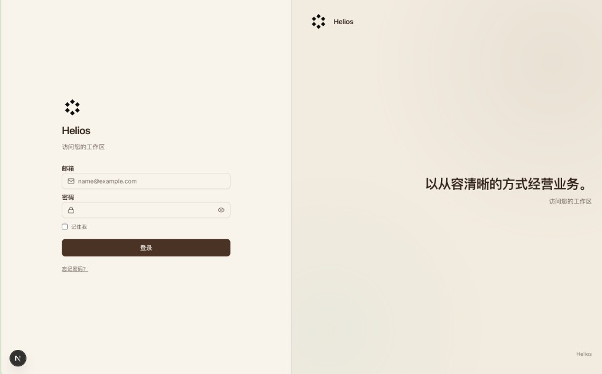
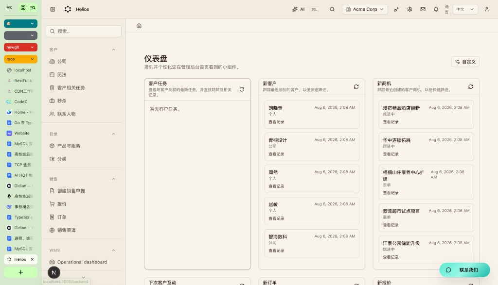

# Helios Flow 产品需求文档（PRD）


| 项    | 内容                                                               |
| ---- | ---------------------------------------------------------------- |
| 产品名  | Helios Flow                                                      |
| 文档版本 | 1.8                                                              |
| 日期   | 2026-08-07                                                       |
| 状态   | 草案，供产品与研发对齐                                                      |
| 仓库   | `helios-flow`                                                    |
| 相关文档 | [README.md](../README.md)、[AGENTS.md](../AGENTS.md)、`.ai/specs/` |


---

## 1. 摘要

Helios Flow 是一套模块化业务平台，由 **核心五块** 与 **经营扩展三块** 组成。

核心五块：

1. 多租户 CRM
2. 销售
3. 商品目录
4. 工作流引擎
5. 管理后台

经营扩展三块（本版产品承诺，非「另立项才做」）：

1. 项目交付（项目 / 里程碑 / 项目风险）
2. 经营结算（合同 → 营收 / 成本 → 开票 → 回款核销；**不是**财务总账）
3. 经营分析与治理（KPI 目标完成率、主数据治理、内置风险场景）

一句话：在统一的多租户后台里跑通 **客户 → 商机 → 项目 → 合同 → 营收/成本 → 开票 → 回款**，并用 AI 做查询、口径解释、治理与风险处置建议。

AI 不是旁路聊天窗：全局入口与各模块工具包共用一套框架，覆盖 CRM、销售、目录、项目、结算、KPI/治理、工作流与管理配置；写操作宜先确认再落库。下一步会做「用自然语言起草工作流定义，人看过再保存」，写法从简。

### 1.1 产品组成


| 组成        | 说明                                                                 |
| --------- | ------------------------------------------------------------------ |
| 多租户 CRM   | 联系人、公司、商机、时间线、自定义字段；按租户与组织隔离                                       |
| 销售        | 报价、订单等单据与相关流转                                                      |
| 商品目录      | 产品、变体、分类与渠道相关陈列                                                    |
| 工作流引擎     | 流程定义、实例、人工任务、定时器、活动执行与事件触发                                         |
| 管理后台      | 登录后的运营壳层：导航、权限、配置、列表与表单                                            |
| 项目交付      | 项目、里程碑、项目风险；挂接客户 / 商机 / 组织 / 负责人                                   |
| 经营结算      | 合同、项目营收、项目成本、开票、回款、开票-回款核销；默认 CNY 不含税；**不做**科目 / 凭证 / 总账         |
| 经营分析与治理   | 区域 / 期间 KPI 目标与完成率；客户去重映射；规则与 AI 跨表风险检测                             |
| AI 助手     | 打通全平台：全局入口 + 各模块工具；写操作宜先确认再落库                                      |
| 自然语言起草工作流 | 用自然语言生成流程草案，在编辑器里确认后再写入                                            |


### 1.2 经营主链（业务本体）

```text
经营目标(KPI) → 组织
    → 客户 → 商机 → 项目 → 合同
                      ├→ 营收 / 成本
                      ├→ 里程碑 / 风险
                      └→ 开票 → 回款（经核销关系）
```

跨表关联一律走业务 ID / 编码；名称仅用于展示，禁止仅靠名称模糊匹配做主关联。本体在产品中落成：**主链实体关系 + 统一口径字典**（组织、产线、商机阶段默认概率等），不做独立重型「企业本体平台」。

---

## 2. 背景与问题

### 2.1 背景

中小公司和产品型团队通常要同时管客户、报价订单、商品，以及审批、交接等流程。工具若拆成多套，主数据容易不一致，权限和审计也难统一。

B 端经营还常见另一类断链：商机赢单后，项目交付、合同履约、开票回款与区域目标分散在表格或财务系统，销售与交付对不上同一套口径；客户主数据重复会进一步导致「同一客户多套经营数字」。

Helios Flow 把 CRM、销售、商品目录、工作流、管理后台，以及项目交付、经营结算与 KPI/治理放在同一套多租户系统里，方便在一个后台完成日常运营与经营闭环分析。

### 2.2 要解决的问题

1. 客户、单据、商品和流程分散在不同系统，协作成本高。
2. 流程配置重，改一次麻烦，又缺少与 CRM / 销售主数据的打通。
3. 既要员工后台运营，也要给客户自助门户，身份与权限不能混成一套。
4. 若引入 AI，需要可控的写权限与确认，避免聊天直接改库；AI 应能按权限触达各业务域，而不是只服务某一个模块。
5. 商机赢单后，项目交付与开票回款断链，无法用同一套 ID 链路解释「从商机到回款」。
6. 客户等主数据重复、阶段与概率冲突、逾期未回等异常缺少统一规则与带证据的处置建议，经营口径易漂移。

### 2.3 当前不展开的方向

以下不进本版主范围，可另立项：

- POS、**完整财务总账**（科目 / 凭证 / 总账）、税务申报、固定资产、独立电商前台
- WhatsApp 客服、B2B PRM 等
- 招标、投标、评标等垂直业务（见 §6.5：靠模块扩展接入，不是核心自带功能）
- 无人审阅、一键自动上线生产工作流
- 独立重型「企业本体平台」；竞赛交卷工具定位（竞赛风格数据仅作参考场景与可选演示包）

说明：**经营结算 ≠ 财务总账**。本版承诺合同到回款的经营层与核销分析，不承诺会计总账。

---

## 3. 目标与非目标

### 3.1 目标

1. 多租户 CRM：管理人、公司、商机与时间线，数据按租户与组织隔离。
2. 销售：管理报价、订单等单据。
3. 商品目录：管理产品、变体与分类。
4. 工作流引擎：创建与运行流程定义，支持人工任务、定时器与常见自动活动。
5. 管理后台：员工可登录运营上述能力，并受 feature 级 RBAC 约束。
6. 客户门户：客户侧自助与员工后台身份分离（按需要启用）。
7. AI 打通全平台：在 CRM、销售、目录、项目、结算、KPI/治理、工作流与管理配置中可查询、解释与辅助；写操作尽量走确认，不默认静默落库。
8. 自然语言起草工作流：用户可用平常说法生成流程草案，在编辑器确认后再保存。
9. 项目交付：管理项目、里程碑与项目风险，并与客户 / 商机关联。
10. 经营结算：管理合同、项目营收与成本、开票、回款及核销关系，支持开票率 / 回款率 / 逾期等经营口径（非总账）。
11. KPI 目标：按组织与期间维护营收、毛利、回款等目标，并计算完成率；公司汇总由下级组织加总得出。
12. 主数据治理与风险：客户去重保留源记录与映射；规则与 AI 检测内置风险场景并给出带证据的建议。

### 3.2 非目标（当前版本）

1. 不追求无人审阅、自动上线生产工作流。
2. 不把 Helios Flow 定位成「什么业务都能自动办完」的通用 Agent 产品。
3. 不在本阶段交付 POS、**完整财务总账**、税务、独立商城前台。
4. 不要求替换用户已有的全部外部自动化平台。
5. 不把产品定位为竞赛交卷工具；竞赛数据仅为参考场景与可选演示包，须标注仿真。
6. 不做独立重型企业本体平台；本体以模块实体、主链关联与口径字典呈现。

---

## 4. 用户与场景

### 4.1 角色


| 角色                | 典型诉求                                       |
| ----------------- | ------------------------------------------ |
| 超级管理员（Superadmin） | 初始化租户、全局配置、开通模块                            |
| 租户管理员（Admin）      | 配置组织、用户、角色权限、工作流与集成、KPI 目标与治理规则            |
| 员工业务用户（Employee）  | 处理客户与单据，执行人工任务                             |
| 销售负责人             | 推进商机与跟进，关注有效 / 加权商机与停滞                     |
| 项目经理              | 维护项目、里程碑与交付风险，对照预算与滚动预测                    |
| 经营分析 / 财务运营（轻）    | 维护合同开票回款与核销，查看回款率与逾期（不要求会计总账能力）           |
| 工作流所有者            | 设计、发布与维护流程定义                               |
| 任务执行者             | 在待办中完成人工任务                                 |
| 门户客户              | 在客户门户查看订单、报价等自助能力                          |


本地开发默认账号见 README：

- `superadmin@acme.com` / `secret`
- `admin@acme.com` / `secret`
- `employee@acme.com` / `secret`

### 4.2 核心场景

**场景 A：管客户与商机**

销售在 CRM 里建联系人与公司，推进商机，并在时间线留下沟通记录。

**场景 B：报价与订单**

从客户或商机出发创建报价，再落到订单类单据，在权限范围内查询与更新。

**场景 C：维护商品目录**

运营维护产品、变体与分类，供销售与渠道使用。

**场景 D：配置并跑工作流**

管理员在可视化或代码方式维护流程定义。业务事件或手动操作启动实例。相关人处理人工任务，管理员查看实例状态。

**场景 E：客户自助**

买方登录门户查看自己的订单或报价。权限与员工后台分离，不能看到其他租户或其他客户的数据。

**场景 F：用自然语言起草工作流**

运营用几句话描述审批或交接流程。助手给出草案，人在编辑器里看一眼，确认后再保存。之后仍按普通工作流启动与跟踪。

**场景 G：AI 打通全平台**

员工从全局入口或模块上下文用助手查询客户、单据、商品、项目、结算或流程，并得到解释与建议。跨模块操作仍受同一套 RBAC 与租户范围约束；若建议改数据，用户确认后再写入。

**场景 H：项目交付**

商机转化或直接立项后，项目经理维护预算与滚动预测、里程碑计划 / 实际日期与状态，登记进度或成本类风险并指定责任人。系统可按截止日判断延期。

**场景 I：合同到回款（经营结算）**

从项目或客户创建合同，登记实际营收与成本、开票与回款，并用开票-回款关系核销。可计算开票率、已核销回款、回款率、应收未回与逾期未回（逾期截止日可配置）。

**场景 J：KPI 目标与完成率**

管理员按区域与年度（或期间）录入营收、毛利额、毛利率、回款目标。实际值从结算与项目明细聚合；完成率 = 实际 ÷ 目标。公司汇总由区域加总，不单独存一份易重复的「公司汇总」源行。

**场景 K：主数据治理与风险处置**

治理流程保留客户源记录，建立「原客户编码 → 统一客户编码」映射。规则或 AI 检出重复客户、商机停滞、阶段概率冲突、项目延期、成本超预算、有收入无成本、到期未回款、超额核销、状态冲突等；结论须含原因、证据 ID、影响对象、责任角色与建议完成日。写操作经确认后落库。

---

## 5. 产品原则

1. **租户默认隔离**：业务数据按 `tenantId` / `organizationId` 收口，禁止串租户。
2. **模块可开关**：能力按模块组织，不绑死成单体 ERP。
3. **流程与主数据同台**：工作流能挂在客户、销售、项目等业务上下文附近，而不是孤立工具。
4. **双身份面**：员工后台与客户门户分开认证与授权。
5. **AI 打通全平台，不替代确认**：助手覆盖核心与经营扩展域，可以建议，重要写入仍由人确认。
6. **先审后写（AI 路径）**：自然语言生成的流程草案，保存前要人看过。
7. **品牌一致**：登录页、壳层与文案统一使用 Helios。
8. **主链可关联、ID 优先**：经营主链对象之间用 ID / 编码关联；禁止仅靠客户名、项目名、合同名做主关联。
9. **源数据可保留映射**：主数据清洗放处理层；去重不删源主键记录，须保留原编码到统一编码的映射与逻辑说明。
10. **结算不是总账**：经营结算服务经营分析与回款跟踪；会计科目、凭证、总账另立项。

---

## 6. 范围划分

### 6.1 核心产品范围


| 域         | 能力摘要                                                                |
| --------- | ------------------------------------------------------------------- |
| 多租户 CRM   | 联系人、公司、商机、时间线、自定义字段                                                 |
| 销售        | 报价、订单等文档流                                                           |
| 商品目录      | 产品、变体、分类、渠道相关陈列                                                     |
| 工作流引擎     | 定义、实例、人工任务、定时器、活动执行、事件触发                                            |
| 管理后台      | 认证登录、壳层导航、RBAC、列表与表单、配置入口                                           |
| 目录与组织     | 租户、组织树、可见性                                                          |
| 客户门户      | 客户账号与门户页、`portal.*` 权限                                              |
| 集成与同步     | 凭证、健康检查、同步运行、适配器                                                    |
| 项目交付      | 项目、里程碑、项目风险；与客户 / 商机 / 组织 / 负责人关联                                   |
| 经营结算      | 合同、项目营收、项目成本、开票、回款、核销关系；经营口径指标                                      |
| 经营分析与治理   | KPI 目标与完成率；客户去重映射；内置 / 可配置风险规则；AI 解释与建议                             |
| AI 框架     | 打通全平台：模块工具包、全局入口、mutation approval（按启用情况）                          |
| 公共设施      | 附件、搜索、通知、Webhook、调度、队列、进度、加密、事件总线                                   |


### 6.2 近程优先（P0）

1. 核心五块稳定可演示：CRM、销售、目录、工作流、管理后台。
2. 本地可启动，默认账号可登录，文档路径可复现。
3. 品牌与壳层体验符合 Helios。
4. 多租户与 RBAC 行为正确，无跨租户数据暴露。
5. AI 全局入口可用，并能按权限触达核心业务域（不全靠各页各搞一套）。

### 6.3 应加强（P1）

1. 工作流个人任务收件箱与更严的任务访问控制。
2. 人工任务完成后的可靠续跑。
3. 业务记录上下文中的任务动作。
4. 活动输出结构更稳定，便于排查。
5. 自然语言起草工作流：生成草案 → 编辑器预览 → 确认后保存。
6. AI 会话按租户与组织隔离（聊天用得多时再加强）。
7. 各核心模块向 AI 注册工具包，保证跨域查询与辅助一致可用。
8. **项目交付模块**：项目 / 里程碑 / 风险 CRUD，延期判断，与客户 / 商机关联。
9. **经营结算模块**：合同 → 营收 / 成本 → 开票 → 回款核销；开票率、回款率、逾期未回等口径可算。
10. **治理规则引擎（基础）**：客户去重映射；至少覆盖竞赛对标的主要风险类型检测。
11. AI 可查询解释项目与结算域，并对治理检出给出带证据 ID 的建议（写操作仍确认）。

### 6.4 后续（P2）与候选

**P2（本版规划内、排在结算事实之后）：**

1. KPI 目标维护与目标完成率看板（公司汇总由区域加总）。
2. AI 风险处置建议深化（责任角色、建议完成日、跨表证据链）。
3. 可选导入竞赛风格仿真数据包（须标注非真实经营事实）。
4. 商机阶段默认概率等口径字典的租户可配置阈值（如停滞天数）。

**后续候选（另立项）：**

1. 自然语言到业务规则 DSL。
2. 工作流作集成编排（外部系统触发与命令活动）。
3. POS、完整财务总账、独立商城、PRM、促销等。
4. 招标 / 投标等垂直业务模块（按客户立项，不进核心五块，也不进经营扩展三块的默认交付）。

### 6.5 平台扩展能力（自带「可加功能」，不自带「招标」）

Helios Flow **自带的是加模块的能力**，不是预装每一个垂直行业功能。

经营闭环（项目、结算、KPI/治理）属于 **本版自带产品范围**；招标等行业包仍靠扩展接入。


| 说法  | 含义                                                              |
| --- | --------------------------------------------------------------- |
| 自带  | 模块系统、RBAC、工作流、自定义字段 / 实体、UI 注入、事件、官方模块开关；以及 §6.1 中的经营扩展三块         |
| 不自带 | 「招标」完整业务包；需单独做成模块或接入官方 / 自研模块后再启用                                 |


典型接入方式（由浅到深）：

1. **配置层**：在现有 CRM / 销售 / 项目实体上加自定义字段；用工作流跑审批节点。
2. **应用模块**：在 `apps/helios/src/modules/<name>/` 新建模块（页面、API、ACL、菜单），挂进 `modules.ts` 后 `yarn generate`。
3. **可复用包 / 官方模块**：做成独立包或走 `official-modules` 激活，多租户可开关。
4. **耦合边界**：与客户、销售、项目等主数据用外键 ID、事件、注入位连接，不建跨模块 ORM 关系。

示例：「招标」可作为独立模块，关联公司 / 商机，菜单与权限按 feature 开通；本版 PRD **不承诺**交付招标业务细节，只承诺平台能按上述方式接入。

---

## 7. 功能需求

### 7.1 CRM / 销售 / 目录


| ID     | 需求            | 优先级 | 验收要点         |
| ------ | ------------- | --- | ------------ |
| CRM-01 | 管理人、公司、商机及时间线 | P0  | 列表、详情、表单、权限  |
| SAL-01 | 管理报价与订单类单据    | P0  | CRUD 与基础流转   |
| CAT-01 | 管理产品、变体、分类    | P0  | CRUD 与检索     |
| EXT-01 | 自定义字段与实体可配置   | P1  | 管理端可声明并在表单出现 |


### 7.2 工作流运行时


| ID       | 需求                                         | 优先级 | 验收要点      |
| -------- | ------------------------------------------ | --- | --------- |
| WF-RT-01 | 常见步骤：开始、结束、人工任务、自动活动、子流程、等待信号或定时、并行分叉与汇合   | P0  | 与引擎能力说明一致 |
| WF-RT-02 | 活动至少可覆盖：发邮件、调 API、Webhook、更新实体、发事件、执行函数、等待 | P0  | 配置与执行日志可查 |
| WF-RT-03 | 实例与步骤状态可查询                                 | P0  | 管理端可见     |
| WF-RT-04 | 人工任务有个人收件箱且 ACL 严格                         | P1  | 非指派人不可操作  |
| WF-RT-05 | 任务完成后实例可靠继续                                | P1  | 进程重启不丢续跑  |


### 7.3 认证、权限、门户


| ID        | 需求                              | 优先级 | 验收要点          |
| --------- | ------------------------------- | --- | ------------- |
| AUTH-01   | 邮箱密码登录，会话安全                     | P0  | 错误信息不暴露账号是否存在 |
| AUTH-02   | 基于 feature 的 RBAC，支持 `module.*` | P0  | 菜单与 API 一致收权  |
| PORTAL-01 | 客户门户独立登录与功能授权                   | P0  | 与员工会话隔离       |
| TENANT-01 | API 与查询强制租户与组织过滤                | P0  | 无跨租户读取路径      |


### 7.4 AI 打通全平台


| ID    | 需求                                      | 优先级 | 验收要点                                |
| ----- | --------------------------------------- | --- | ----------------------------------- |
| AI-01 | 模块级助手可注册工具包                             | P0  | CRM / 销售 / 目录 / 工作流等可注册并可用           |
| AI-02 | 全局助手入口可用，可跨模块对话                         | P0  | 配置密钥后可打开；能问到多业务域数据（在权限内）            |
| AI-03 | 写操作待确认                                  | P0  | 确认、取消状态清晰                           |
| AI-04 | 可配置模型与供应商密钥                             | P1  | 环境变量或设置页生效                          |
| AI-05 | 会话按范围隔离                                 | P2  | 切租户不串会话                             |
| AI-06 | 助手遵守与页面 / API 同一套 feature 与租户过滤         | P0  | 无权限则拒绝；无跨租户读取                       |
| AI-07 | 项目与经营结算域可查询与解释                          | P1  | 权限内可问到项目、合同、开票、回款等                  |
| AI-08 | 可解释默认经营口径（有效商机、加权商机、毛利、开票率、回款率等）        | P1  | 解释与 §7.9 口径一致                       |
| AI-09 | 对治理检出给出带证据 ID、影响对象、责任角色与建议完成日的处置建议     | P1  | 建议可追溯到源记录；写入须确认                     |


### 7.5 自然语言起草工作流


| ID       | 需求               | 优先级 | 验收要点           |
| -------- | ---------------- | --- | -------------- |
| WF-AI-01 | 可用自然语言生成流程草案     | P1  | 能出可读草案，不要求一次完美 |
| WF-AI-02 | 草案在编辑器中预览，确认后再写入 | P1  | 未确认不保存         |
| WF-AI-03 | 可解释已有定义          | P1  | 解释基于真实定义       |
| WF-AI-04 | 遵守 RBAC 与租户范围    | P1  | 无权限则拒绝         |


### 7.6 品牌与体验


| ID    | 需求                      | 优先级 | 验收要点       |
| ----- | ----------------------- | --- | ---------- |
| UX-01 | 产品名与 Logo 统一使用 Helios   | P0  | 登录、壳层、文案抽查 |
| UX-02 | 支持米棕暖色与经典白色切换           | P1  | 头像菜单可切换    |
| UX-03 | 登录与壳层有清晰品牌感             | P1  | 与通用白牌后台可区分 |


#### 登录页参考截图（2026-08-07）

当前登录页布局：左侧表单，右侧品牌文案；暖色米棕主题。作为 UX-01 / UX-03 的视觉对照。



#### 管理后台壳层参考截图（2026-08-07）

首版壳层改动偏弱（顶栏与侧栏同色，仍像经典左导航后台）。目标对照：全宽顶栏承载品牌 / 搜索 / 操作，侧栏只留导航，内容区独立阅读栏宽。



### 7.7 项目交付（`projects`）


| ID     | 需求                                      | 优先级 | 验收要点                         |
| ------ | --------------------------------------- | --- | ---------------------------- |
| PRJ-01 | 管理项目：关联客户 / 商机 / 组织 / 项目经理，含预算与滚动预测营收成本 | P1  | CRUD、权限、租户隔离；列表与详情可用         |
| PRJ-02 | 管理项目里程碑：计划日期、实际日期、状态                    | P1  | 可按项目查看；计划日已过且无实际完成日可判延期      |
| PRJ-03 | 管理项目风险：类型、责任人、状态                        | P1  | 可挂项目；证据可追溯到 `risk_id` 等主键    |
| PRJ-04 | 项目与里程碑状态一致性可被规则检测                       | P1  | 状态冲突可进入治理检出列表                |


### 7.8 经营结算（非总账）


| ID     | 需求                                       | 优先级 | 验收要点                                |
| ------ | ---------------------------------------- | --- | ----------------------------------- |
| FIN-01 | 管理合同：金额、类型、期限、付款条款；关联客户 / 项目             | P1  | CRUD、权限、租户隔离                       |
| FIN-02 | 登记项目营收（实际）与项目成本（人工 / 外采 / 外包等）           | P1  | 可按项目与期间汇总；金额默认 CNY、不含税             |
| FIN-03 | 管理开票：金额、开票日、到期日；关联合同 / 项目                | P1  | CRUD；可参与开票率计算                      |
| FIN-04 | 管理回款及开票-回款核销关系                           | P1  | 已核销回款按核销额汇总，避免按回款流水重复计算            |
| FIN-05 | 支持开票率、回款率、应收未回、逾期未回等经营指标                 | P1  | 与 §7.9 默认口径一致；逾期截止日可配置             |
| FIN-06 | 明确产品边界文案：本模块为经营结算，非会计总账                  | P1  | 文档与 UI 不承诺科目 / 凭证 / 总账             |


### 7.9 默认经营判断口径

以下为产品默认口径（租户可配置阈值处另开；指标计算须标明源表、过滤、公式、截止日与币种）：


| 指标 / 判断   | 计算规则                                              | 过滤与说明                                      |
| --------- | ------------------------------------------------- | ------------------------------------------ |
| 有效商机金额    | Σ `estimated_amount`                              | `opportunity_status=进行中`，且阶段不为丢单              |
| 加权商机金额    | Σ `estimated_amount × win_probability ÷ 100`      | 仅有效商机；`win_probability` 为 0–100 整数        |
| 商机停滞      | 数据截止日 − `last_followup_date` > 60 天（默认可配置）        | 仅进行中商机                                     |
| 实际营收      | Σ `recognized_revenue`                            | 营收数据版本 = 实际                                |
| 实际成本      | Σ `cost_amount`                                   | 成本数据版本 = 实际                                |
| 项目毛利额     | 实际营收 − 实际成本                                       | 可按项目 / 客户 / 区域 / 产线聚合                      |
| 项目毛利率     | 项目毛利额 ÷ 实际营收                                      | 营收为 0 时结果为空并提示                            |
| 开票率       | Σ `invoice_amount` ÷ Σ `contract_amount`          | 可按合同或汇总维度                                  |
| 已核销回款     | Σ `allocated_amount`                              | 基于核销关系表，避免回款重复                             |
| 回款率       | Σ `allocated_amount` ÷ Σ `invoice_amount`         | 按开票口径                                      |
| 应收未回款     | Σ `invoice_amount` − Σ `allocated_amount`         | 先按开票聚合再汇总                                  |
| 逾期未回款     | `due_date` < 截止日且未核销额 > 0                         | 截止日租户可配置（演示包可对齐 2026-08-31）                |
| 目标完成率     | 实际值 ÷ `target_value`                              | 同组织、同指标、同期间、同单位匹配                          |
| 项目延期      | `planned_date` < 截止日且 `actual_date` 为空            | 同时可校验里程碑状态                                 |


商机阶段默认概率参考（口径字典，可配置）：RFI 20%、RFQ 45%、已定点 75%、签约 90%、赢单 100%、丢单 0%。

### 7.10 KPI 目标


| ID     | 需求                                      | 优先级 | 验收要点                              |
| ------ | --------------------------------------- | --- | --------------------------------- |
| KPI-01 | 按组织与期间维护营收、毛利额、毛利率、回款等目标                | P2  | CRUD；单位区分金额与比率                    |
| KPI-02 | 实际值从项目营收 / 成本 / 核销回款等明细聚合               | P2  | 与结算事实表一致，禁止手填「假实际」覆盖聚合（除非显式覆盖策略）  |
| KPI-03 | 目标完成率可按区域展示；公司汇总 = 下级区域加总               | P2  | 不存易重复的公司汇总源行；汇总为派生结果              |


### 7.11 主数据治理与风险场景


| ID     | 需求                                                         | 优先级 | 验收要点                           |
| ------ | ---------------------------------------------------------- | --- | ------------------------------ |
| GOV-01 | 客户去重：保留源记录，维护「原客户编码 → 统一客户编码」映射                            | P1  | 禁止仅删除源主键当「清洗完成」                |
| GOV-02 | 内置或可配置检测：客户重复、商机停滞、阶段概率冲突、项目延期、成本超预算、有收入无成本、到期未回款、超额核销、状态冲突 | P1  | 检出列表含类型、证据 ID、源表               |
| GOV-03 | 风险 / 治理结论结构化：原因、证据、影响对象、责任角色、建议完成日                         | P1  | 与 AI-09 一致；可落库或导出              |
| GOV-04 | 清洗对象放在处理层，原始工作表 / 主键 / 记录完整保留                               | P1  | 完整性检查不靠删异常记录绕过                 |
| GOV-05 | 可选竞赛风格仿真演示包导入；界面与文档标注非真实经营事实                               | P2  | 不得对外表述为真实经营数据                  |


---

## 8. 典型使用路径

```text
登录管理后台
    |
    +---> CRM：客户 / 公司 / 商机 / 跟进
    |
    +---> 销售：报价 / 订单
    |
    +---> 目录：产品 / 分类
    |
    +---> 项目：立项 -> 里程碑 -> 风险
    |
    +---> 经营结算：合同 -> 营收/成本 -> 开票 -> 回款核销
    |
    +---> 经营：KPI 目标与完成率 / 治理检出与处置
    |
    +---> 工作流：维护定义 -> 启动实例 -> 人工任务 / 自动活动 -> 结束
    |
    +---> 设置：用户、角色、组织、集成
    |
    +---> AI（全平台）：查客户 / 项目 / 结算 / 指标 / 风险；解释与建议；写操作先确认
    |
    +---> 自然语言起草工作流：出草案 -> 人确认 -> 保存定义
```

---

## 9. 信息架构（管理端）

1. **工作台 / 仪表盘**（可含经营摘要：回款、逾期、KPI 完成率入口）
2. **客户**：人、公司、商机
3. **销售**：报价、订单
4. **目录**：产品与分类
5. **项目**：项目、里程碑、风险
6. **经营结算**：合同、营收 / 成本、开票、回款与核销
7. **经营分析**：KPI 目标、完成率；治理检出与客户映射
8. **工作流**：定义、实例、任务
9. **设置**：用户、角色、组织、集成、AI 相关偏好
10. **门户**（客户侧）：`/{orgSlug}/portal/...`

全局：搜索、通知、组织切换（若启用）、**AI 全平台入口**（可进入各业务域上下文）。

---

## 10. 非功能需求


| 类别  | 要求                                      |
| --- | --------------------------------------- |
| 安全  | 租户隔离；敏感字段可加密；登录限流；最小错误信息                |
| 权限  | 页面与 API 使用同一套 feature；通配授权行为一致          |
| 可靠  | 队列任务可重试；长任务有进度反馈                        |
| 审计  | 命令写路径保留必要审计（按现有命令模式）                    |
| 性能  | 列表默认分页；`pageSize` 不超过 100               |
| 可运维 | 本地依赖 Postgres 与 Redis；配置与日志可排查          |
| 国际化 | 用户可见文案走 i18n；中文为重要目标语言之一                |
| 兼容  | 遵守 `BACKWARD_COMPATIBILITY.md` 对公开契约的约束 |
| 数据声明 | 仿真 / 演示数据须标注；不得表述为真实经营事实                 |


---

## 11. 成功指标

### 11.1 核心产品

1. 演示租户可完成：建客户、建商品、建报价或订单、配置并跑通一条含人工任务的工作流。
2. 三角色账号可登录，权限差异符合预期。
3. 抽检无跨租户数据可见。

### 11.2 体验与品牌

1. 新用户约 15 分钟内能登录并完成一项业务操作（建客户或看一单流程）。
2. 登录与壳层品牌为 Helios，体验可区分于通用白牌后台。

### 11.3 AI 打通全平台

1. 全局助手可对话，并能按权限查询或解释 CRM、销售、目录、工作流等核心域。
2. 写操作确认链路可用。
3. 能从自然语言得到流程草案，并在确认后保存；不追求一次生成即可上线。

### 11.4 经营闭环与治理

1. 可从商机或客户立项，维护里程碑并标出延期与风险。
2. 可完成合同 → 营收 / 成本 → 开票 → 回款核销，并算出开票率、回款率、逾期未回。
3. 可维护区域 KPI 并展示完成率；公司汇总为派生加总。
4. 可演示客户去重映射，以及至少一类跨表风险检出 + 带证据的 AI / 规则建议。

---

## 12. 里程碑建议


| 阶段  | 内容                                      | 退出标准                                      |
| --- | --------------------------------------- | ----------------------------------------- |
| M0  | 本地可跑、文档与默认账号清晰                          | README 路径可复现                              |
| M1  | 核心五块可稳定演示                               | CRM / 销售 / 目录 / 工作流 / 后台抽检通过               |
| M2  | 工作流任务体验与续跑加固                            | P1 中任务相关项达标                               |
| M3  | AI 打通全平台                               | 全局入口 + 核心模块工具可用；写操作可确认                    |
| M4  | 自然语言起草工作流                               | 能出草案并确认保存                                 |
| M5  | 项目交付：项目 / 里程碑 / 风险 + 与商机 / 客户关联         | 可建项目、标延期与风险                               |
| M6  | 经营结算：合同 → 营收 / 成本 → 开票 → 回款核销           | 可算开票率、回款率、逾期未回款                           |
| M7  | KPI 目标 + 治理规则 + AI 跨表风险 / 指标解释；可选仿真演示包 | 可演示重复客户、停滞商机、KPI 完成率，并给出带证据建议             |


日期由项目排期填写。本文件不绑定具体日历。P0 仍守核心五块与 AI 底座；M5–M7 对应经营扩展，避免拖垮 M1 演示。

---

## 13. 依赖与风险


| 风险                 | 影响        | 缓解                                      |
| ------------------ | --------- | --------------------------------------- |
| 自然语言草稿质量不稳定        | 用户不好用     | 强制人审；先求能用，再慢慢提高质量                       |
| 助手权限过宽             | 误改或越权     | feature 门控、写操作确认、租户过滤测试                 |
| 工作流与业务模块耦合过紧       | 难维护       | 用事件与外键，不建跨模块 ORM 关系                     |
| 把经营结算做成「半个总账」      | 范围失控、主线失焦 | 非目标写清：无科目 / 凭证 / 总账；UI 与文档统一称经营结算       |
| 结算与 KPI 口径不一致      | 经营数字不可信   | §7.9 默认口径；指标须标明源表、过滤、公式、截止日、币种          |
| 客户去重误删源数据          | 无法追溯与对账   | GOV-01/04：映射层 + 禁止删源主键当清洗               |
| 仿真 / 竞赛风格数据被当成真实经营 | 合规与声誉风险   | 强制标注仿真；演示包与对外材料禁止写成真实事实                 |
| 范围膨胀到 POS          | 主线失焦      | 非目标写清，另立项                               |
| 密钥与环境不一致           | 登录或功能异常   | 初始化文档与 `.env.example` 对齐                |


---

## 14. 技术方案边界（给研发的约束，非实现设计）

1. 继续使用现有模块系统与管理应用壳，不新起第二套后台。
2. 工作流仍走现有 workflows 模块实体与运行时。
3. 跨模块只通过事件、注入、enricher、外键 ID，不建跨模块 ORM 关系。
4. AI 落在统一 assistant 框架内：各业务模块注册工具，全局入口复用；写路径宜复用确认机制。
5. 项目、经营结算、KPI/治理以独立模块（或少数聚合模块）落地，模块 id 用复数 snake_case；详细实体与 API 以 `.ai/specs/` 为准。
6. 详细接口与数据模型以 `.ai/specs/` 为准；本 PRD 管范围与验收方向。

---

## 15. 开放问题

1. 对外主叙事如何平衡「业务后台」「经营闭环」与「AI 打通全平台」？
2. AI 默认开还是默认关？
3. 自然语言起草工作流先做「解释」还是先做「生成」？
4. 商业版（enterprise）能力如何与 Helios Flow 对外表述区分？
5. 各核心模块与经营扩展模块 AI 工具包的最低覆盖清单如何定（先查后写）？
6. 经营结算模块在仓库中拆成 `contracts` + `billing`，还是单一 `commercial` / `settlements` 模块？
7. 治理规则引擎首版放在独立 `governance` 模块，还是先挂在 CRM + 共享规则服务？

---

## 16. 附录：与仓库的对应关系


| PRD 概念     | 仓库位置（指引）                                                          |
| ---------- | ----------------------------------------------------------------- |
| 产品概述与本地登录  | `README.md`                                                       |
| 模块开发与安全红线  | `AGENTS.md`                                                       |
| 工作流引擎      | `packages/core/src/modules/workflows/AGENTS.md`                   |
| AI 助手框架    | `packages/ai-assistant/`、`apps/docs/docs/framework/ai-assistant/` |
| CRM 参考模块   | `packages/core/src/modules/customers/`                            |
| 项目交付（待建）   | `packages/core/src/modules/projects/`（或 `apps/helios/src/modules/projects/`） |
| 经营结算（待建）   | `packages/core/src/modules/commercial/` 或拆分 `contracts` / `billing` |
| KPI / 治理（待建） | `packages/core/src/modules/insights/`、`governance/`（命名以规格为准）     |
| 工程规格       | `.ai/specs/`、`.ai/specs/implemented/`                             |


---

## 17. 修订记录


| 版本  | 日期         | 说明                                                         |
| --- | ---------- | ---------------------------------------------------------- |
| 1.0 | 2026-08-06 | 首版                                                         |
| 1.1 | 2026-08-07 | 强调 CRM、销售、目录、工作流、管理后台为产品组成                                 |
| 1.2 | 2026-08-07 | 去掉「已交付」强口径；自然语言工作流写轻                                       |
| 1.3 | 2026-08-07 | 自然语言起草工作流仍作为要做的事，去掉「探索 / 不承诺」表述，整体写轻                       |
| 1.4 | 2026-08-07 | 7.6 增加登录页参考截图（暖色主题、左表单右品牌）                                 |
| 1.5 | 2026-08-07 | 7.6 增加后台仪表盘截图；明确壳层需与经典左导航后台明显区分                             |
| 1.6 | 2026-08-07 | 增加 §6.5：平台可扩展接入垂直功能（如招标），核心不自带招标包                           |
| 1.7 | 2026-08-07 | 去掉上游品牌残留表述；强调 AI 打通全平台                                     |
| 1.8 | 2026-08-07 | 纳入经营闭环：项目交付、经营结算（非总账）、KPI、主数据治理与风险；增加 M5–M7 与默认经营口径       |

