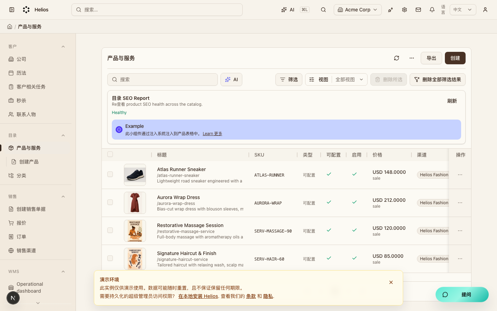
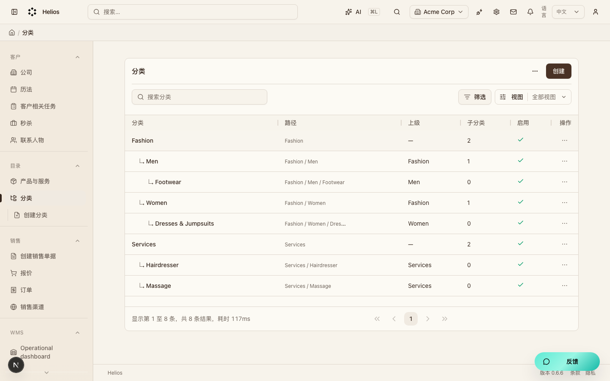

# 商品目录（`catalog`）模块走查

可售商品主数据。产品、变体与分类供销售引用。

**看图：** 请用浏览器打开 [walkthrough.html](./catalog.html)。Cursor 默认 Markdown 预览常常不显示本地图片。

总索引：[index.html](./index.html) · 经营闭环总览：[../operating-loop-walkthrough.html](../operating-loop-walkthrough.html)

## 后台入口

| 页面 | 路径 |
|------|------|
| 产品 | `/backend/catalog/products` |
| 分类 | `/backend/catalog/categories` |

## 界面截图

### 产品列表

入口：`/backend/catalog/products`

### 分类列表

入口：`/backend/catalog/categories`

## 要点

- 产品可维护变体；分类用于组织目录树。

## 相关

- PRD：[`docs/PRD.md`](../PRD.md)
- 模块代码：`packages/core/src/modules/catalog/`

---

截图日期：2026-08-08 · 演示环境 `http://localhost:3000` · `admin@acme.com`
