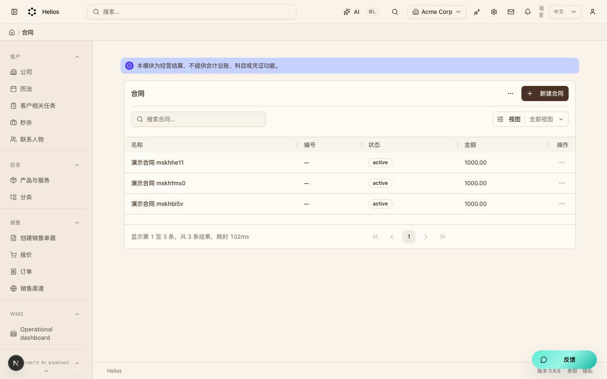
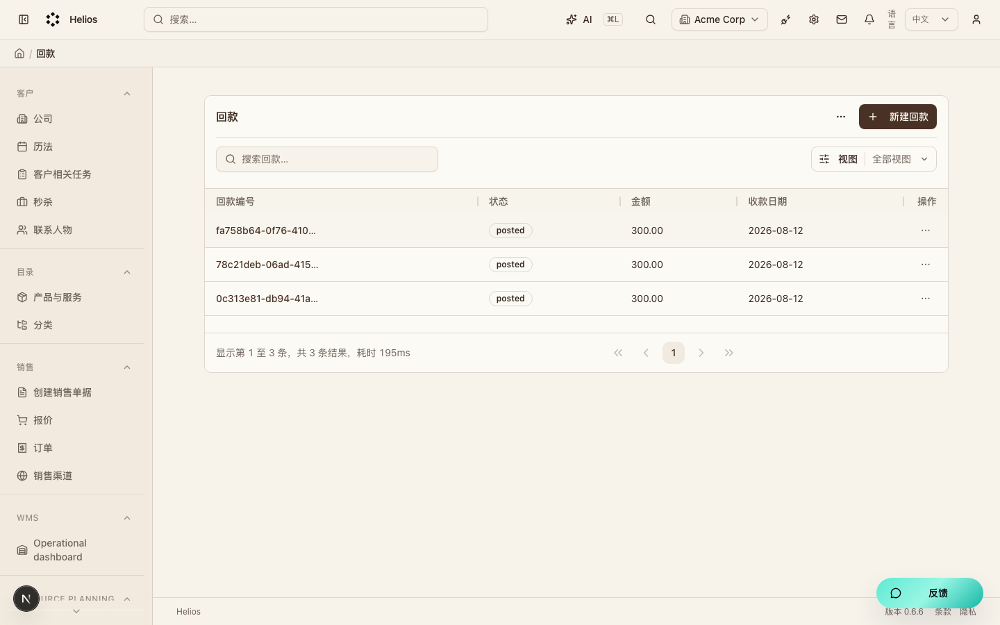
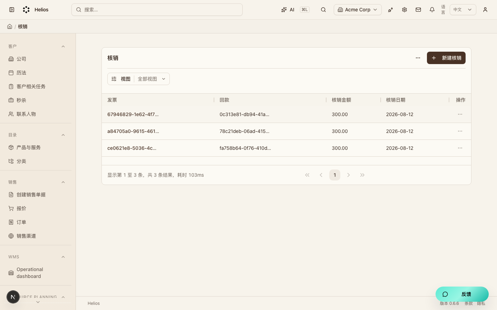

# 经营结算（`commercial`）模块走查

经营结算（M6）。合同 → 营收/成本 → 开票 → 回款核销。不是总账。

**看图：** 请用浏览器打开 [walkthrough.html](./commercial.html)。Cursor 默认 Markdown 预览常常不显示本地图片。

总索引：[index.html](./index.html) · 经营闭环总览：[../operating-loop-walkthrough.html](../operating-loop-walkthrough.html)

## 后台入口

| 页面 | 路径 |
|------|------|
| 合同 | `/backend/commercial/contracts` |
| 开票 | `/backend/commercial/invoices` |
| 回款 | `/backend/commercial/payments` |
| 核销 | `/backend/commercial/allocations` |

## 界面截图

### 合同列表

入口：`/backend/commercial/contracts`

### 开票列表

入口：`/backend/commercial/invoices`

### 回款列表

入口：`/backend/commercial/payments`

### 核销列表

入口：`/backend/commercial/allocations`

## 要点

- 只统计 active/completed 合同与 issued 开票。
- 合同详情「指标」页展示开票率、回款率、应收等。

## 相关

- PRD：[`docs/PRD.md`](../PRD.md)
- 模块代码：`packages/core/src/modules/commercial/`

---

截图日期：2026-08-08 · 演示环境 `http://localhost:3000` · `admin@acme.com`
