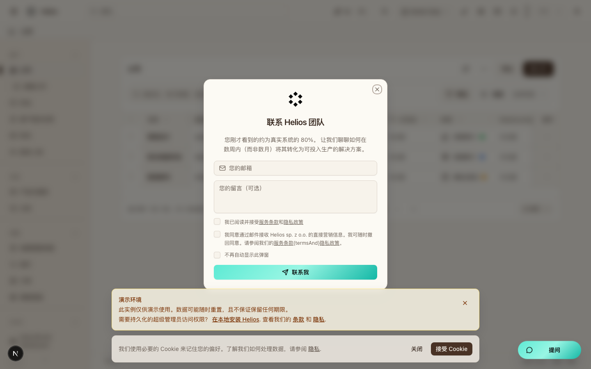
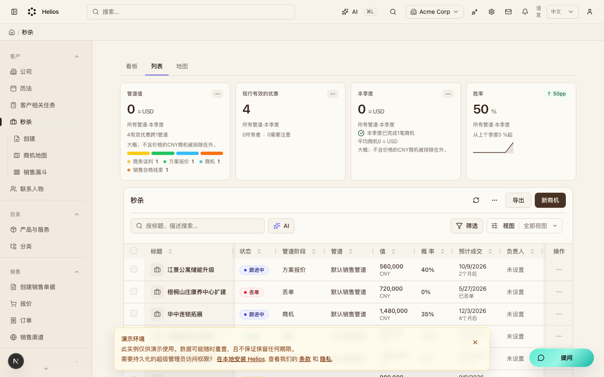
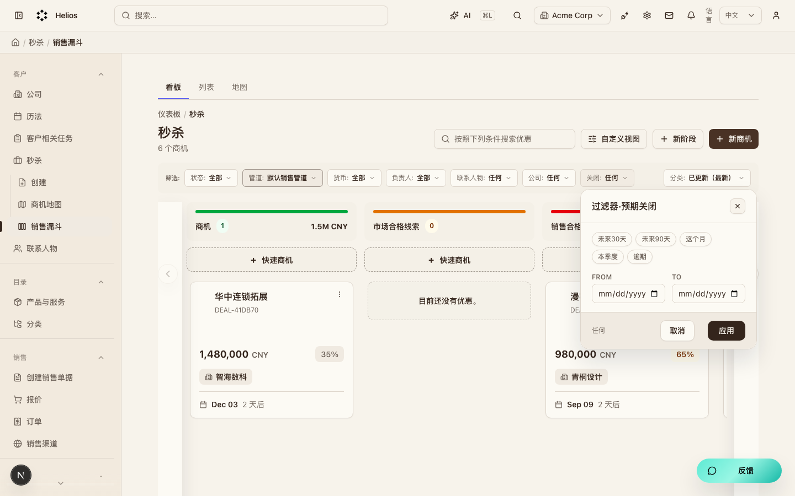
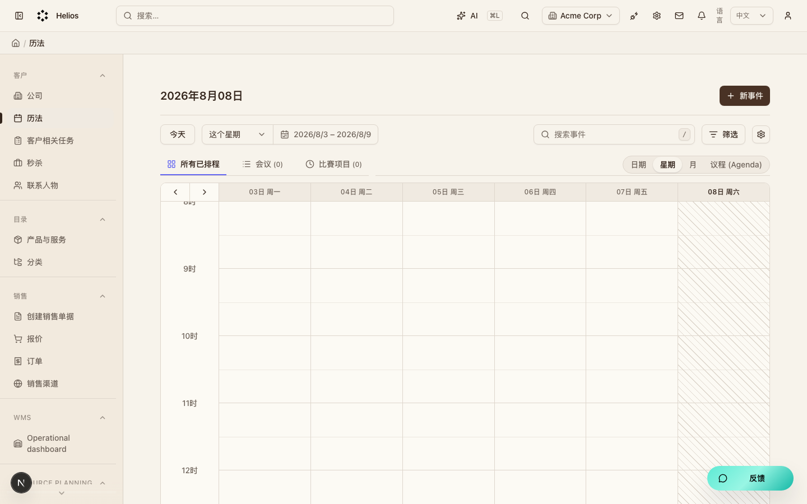

# 客户 CRM（`customers`）模块走查

经营闭环起点。维护公司、联系人与商机，再立项或签合同。

**看图：** 请用浏览器打开 [walkthrough.html](./customers.html)。Cursor 默认 Markdown 预览常常不显示本地图片。

总索引：[index.html](./index.html) · 经营闭环总览：[../operating-loop-walkthrough.html](../operating-loop-walkthrough.html)

## 后台入口

| 页面 | 路径 |
|------|------|
| 公司 | `/backend/customers/companies` |
| 商机 | `/backend/customers/deals` |
| 商机看板 | `/backend/customers/deals/pipeline` |
| 日历 | `/backend/calendar` |

## 界面截图

### 公司列表

入口：`/backend/customers/companies`

### 商机列表

入口：`/backend/customers/deals`

### 商机看板

入口：`/backend/customers/deals/pipeline`

### 客户日历

入口：`/backend/calendar`

## 要点

- 公司详情页可注入「创建项目」「创建合同」等跨模块按钮。
- 商机详情可创建项目（projects 注入）。

## 相关

- PRD：[`docs/PRD.md`](../PRD.md)
- 模块代码：`packages/core/src/modules/customers/`

---

截图日期：2026-08-08 · 演示环境 `http://localhost:3000` · `admin@acme.com`
