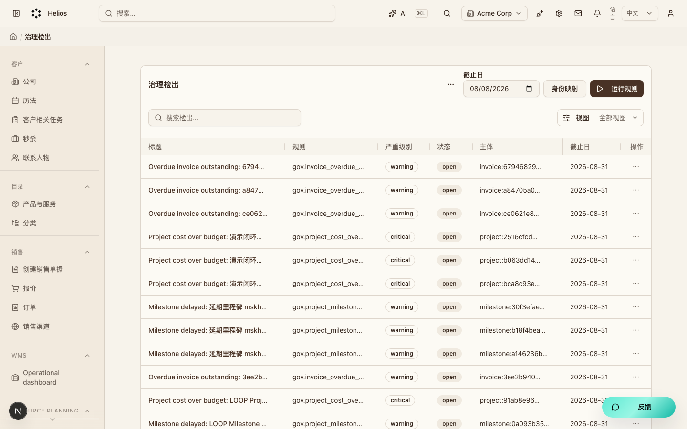
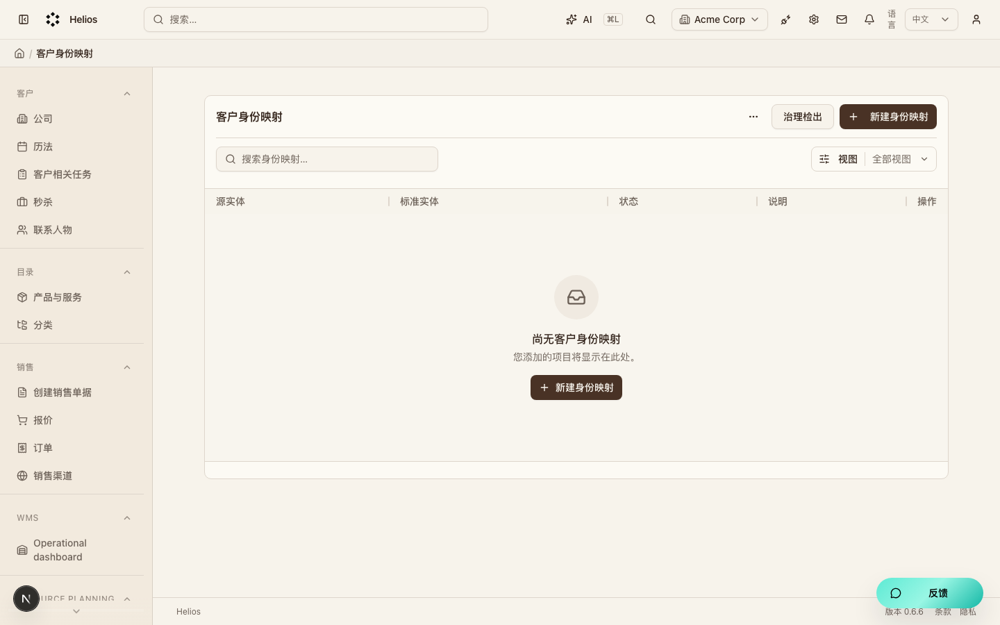

# 治理（`governance`）模块走查

主数据治理与风险检出（M7）。身份映射保留源客户，不自动合并删除。

**看图：** 请用浏览器打开 [walkthrough.html](./governance.html)。Cursor 默认 Markdown 预览常常不显示本地图片。

总索引：[index.html](./index.html) · 经营闭环总览：[../operating-loop-walkthrough.html](../operating-loop-walkthrough.html)

## 后台入口

| 页面 | 路径 |
|------|------|
| 治理检出 | `/backend/governance/findings` |
| 身份映射 | `/backend/governance/identity-maps` |

## 界面截图

### 治理检出

入口：`/backend/governance/findings`

### 身份映射

入口：`/backend/governance/identity-maps`

## 要点

- 「运行规则」写入检出；证据可点到项目、开票等页面。
- AI 助手 acknowledge 需操作者确认。

## 相关

- PRD：[`docs/PRD.md`](../PRD.md)
- 模块代码：`packages/core/src/modules/governance/`

---

截图日期：2026-08-08 · 演示环境 `http://localhost:3000` · `admin@acme.com`
