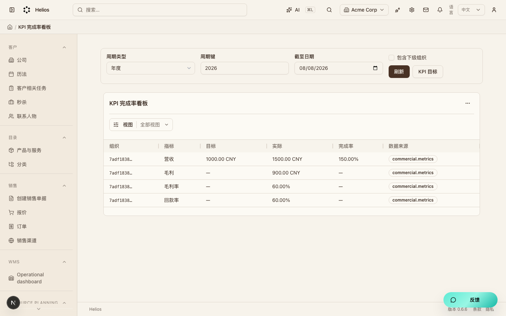
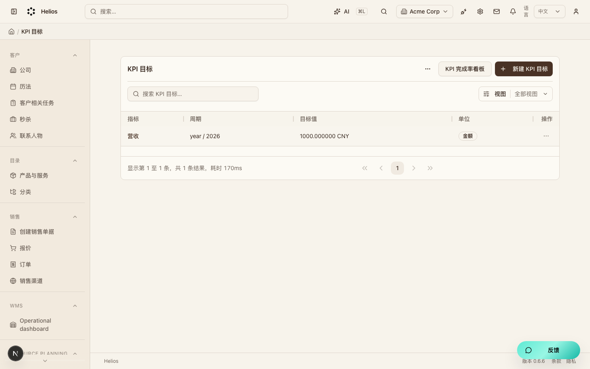

# 经营分析 KPI（`insights`）模块走查

KPI 目标与完成率（M7）。实际值来自 commercial.metrics。

**看图：** 请用浏览器打开 [walkthrough.html](./insights.html)。Cursor 默认 Markdown 预览常常不显示本地图片。

总索引：[index.html](./index.html) · 经营闭环总览：[../operating-loop-walkthrough.html](../operating-loop-walkthrough.html)

## 后台入口

| 页面 | 路径 |
|------|------|
| 完成率看板 | `/backend/insights/kpi` |
| KPI 目标 | `/backend/insights/kpi-targets` |

## 界面截图

### KPI 完成率看板

入口：`/backend/insights/kpi`

### KPI 目标列表

入口：`/backend/insights/kpi-targets`

## 要点

- 先建目标，再在看板按期间查看完成率。
- 公司汇总为派生加总，不是手工改实际值。

## 相关

- PRD：[`docs/PRD.md`](../PRD.md)
- 模块代码：`packages/core/src/modules/insights/`

---

截图日期：2026-08-08 · 演示环境 `http://localhost:3000` · `admin@acme.com`
