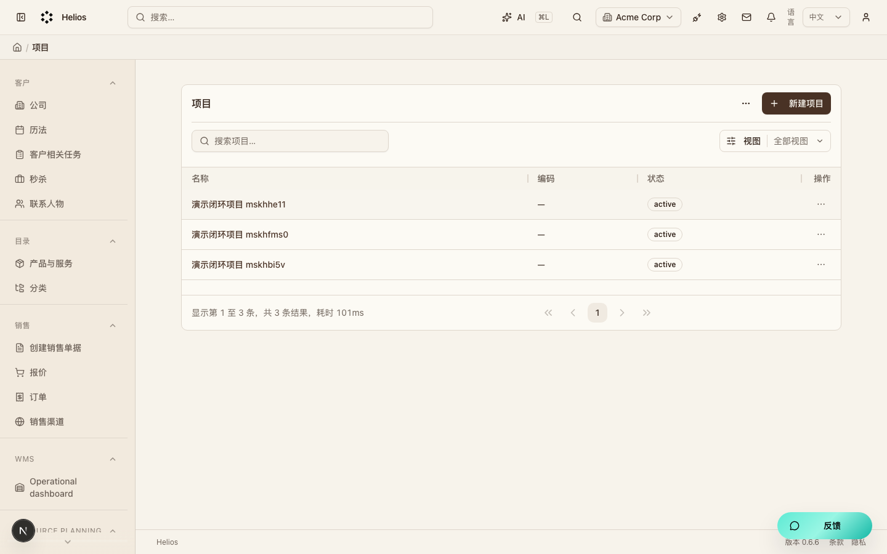
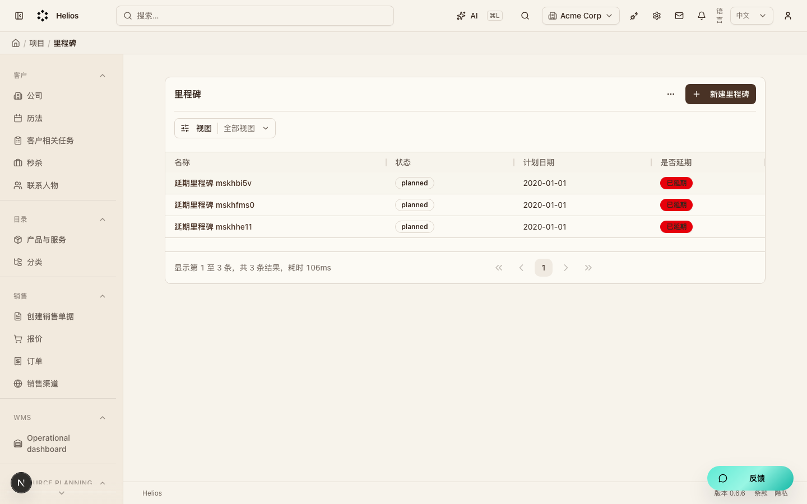
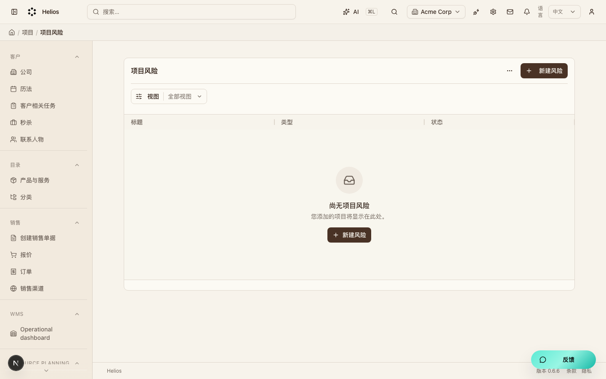

# 项目交付（`projects`）模块走查

交付主档（M5）。从商机/客户立项，维护里程碑与风险。

**看图：** 请用浏览器打开 [walkthrough.html](./projects.html)。Cursor 默认 Markdown 预览常常不显示本地图片。

总索引：[index.html](./index.html) · 经营闭环总览：[../operating-loop-walkthrough.html](../operating-loop-walkthrough.html)

## 后台入口

| 页面 | 路径 |
|------|------|
| 项目 | `/backend/projects` |
| 里程碑 | `/backend/milestones` |
| 风险 | `/backend/risks` |

## 界面截图

### 项目列表

入口：`/backend/projects`

### 里程碑列表

入口：`/backend/milestones`

### 风险列表

入口：`/backend/risks`

## 要点

- 项目详情可「创建合同」进入经营结算。
- 延期里程碑会被治理规则检出。

## 相关

- PRD：[`docs/PRD.md`](../PRD.md)
- 模块代码：`packages/core/src/modules/projects/`

---

截图日期：2026-08-08 · 演示环境 `http://localhost:3000` · `admin@acme.com`
