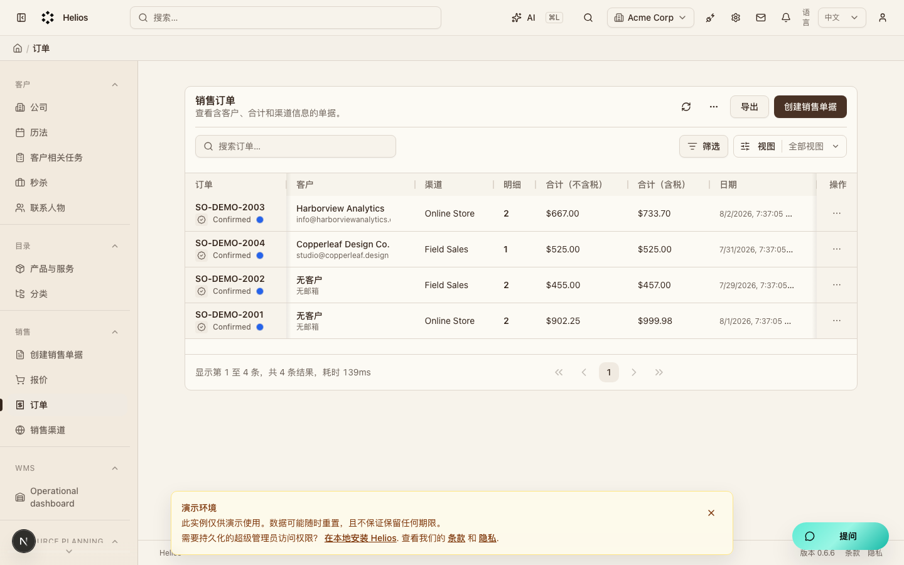
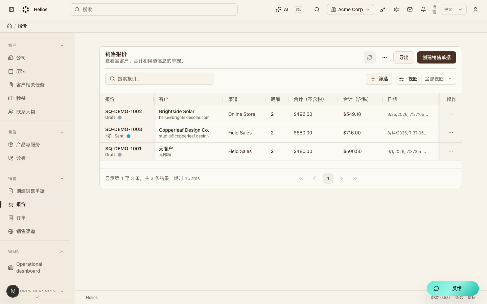
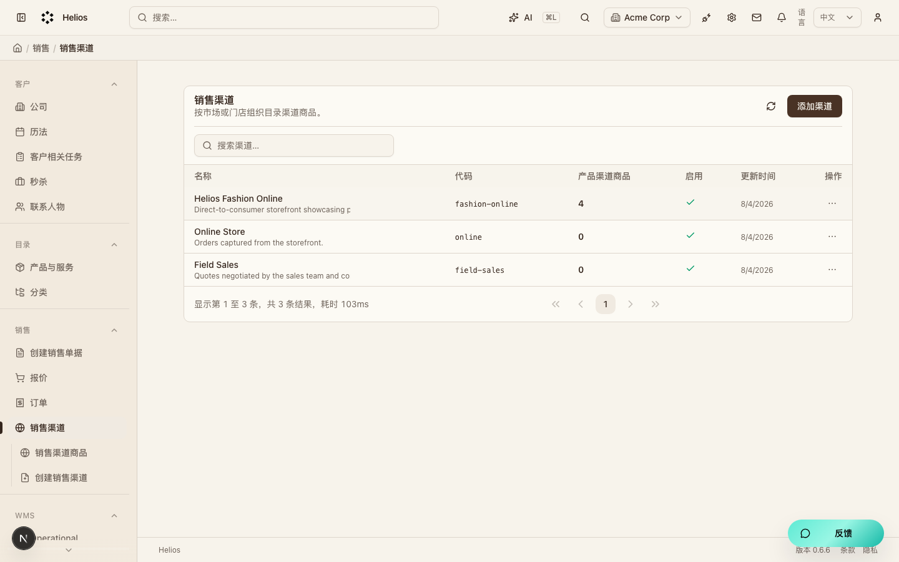

# 销售（`sales`）模块走查

成交单据层。报价与订单引用目录商品，并关联客户。

**看图：** 请用浏览器打开 [walkthrough.html](./sales.html)。Cursor 默认 Markdown 预览常常不显示本地图片。

总索引：[index.html](./index.html) · 经营闭环总览：[../operating-loop-walkthrough.html](../operating-loop-walkthrough.html)

## 后台入口

| 页面 | 路径 |
|------|------|
| 订单 | `/backend/sales/orders` |
| 报价 | `/backend/sales/quotes` |
| 销售渠道 | `/backend/sales/channels` |

## 界面截图

### 订单列表

入口：`/backend/sales/orders`

### 报价列表

入口：`/backend/sales/quotes`

### 销售渠道

入口：`/backend/sales/channels`

## 要点

- 与 customers、catalog 解耦：用 ID 关联，不做跨模块 ORM。

## 相关

- PRD：[`docs/PRD.md`](../PRD.md)
- 模块代码：`packages/core/src/modules/sales/`

---

截图日期：2026-08-08 · 演示环境 `http://localhost:3000` · `admin@acme.com`
