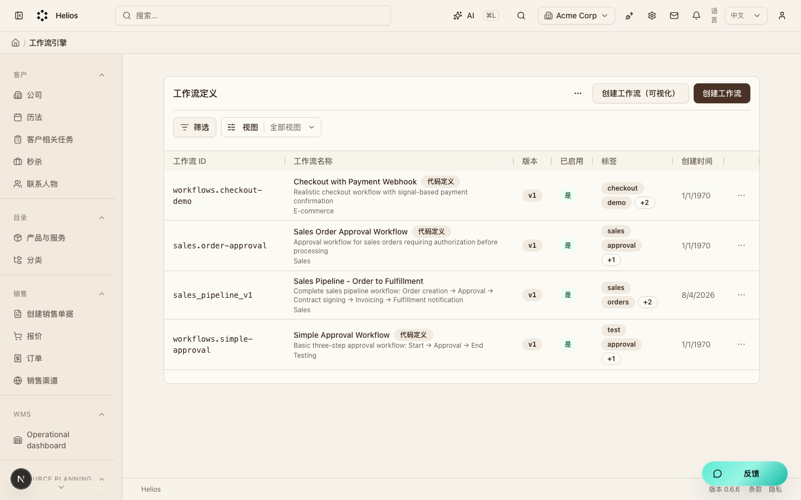
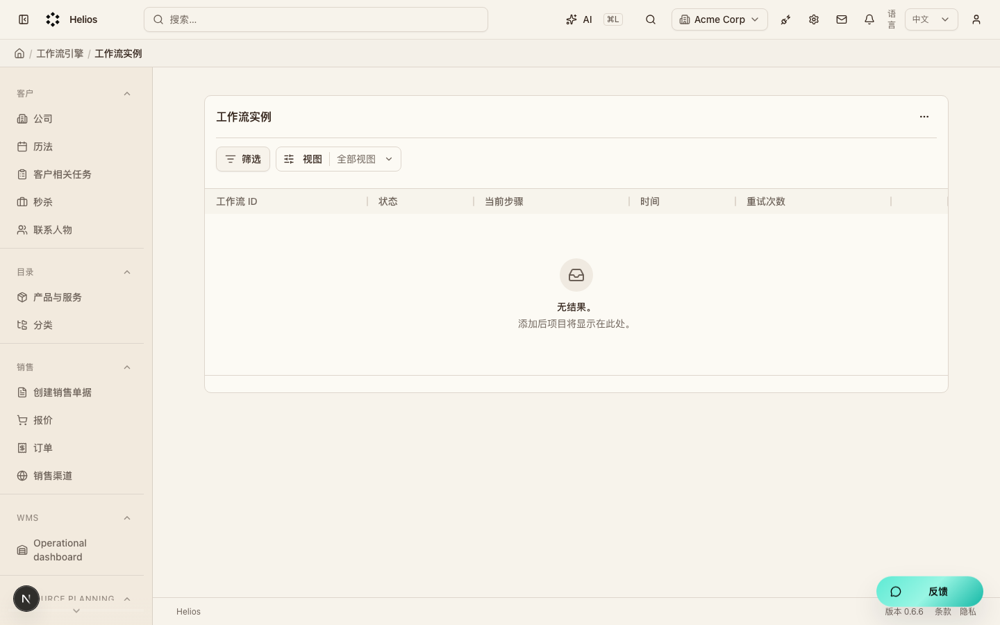
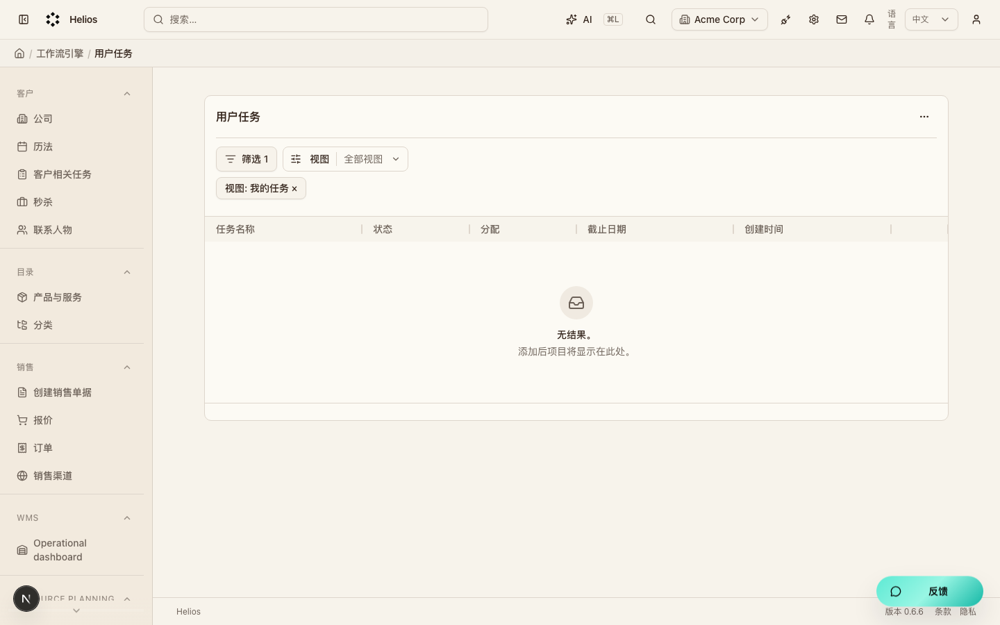

# 工作流（`workflows`）模块走查

跨模块流程编排。定义流程后产生实例与人工任务。

**看图：** 请用浏览器打开 [walkthrough.html](./workflows.html)。Cursor 默认 Markdown 预览常常不显示本地图片。

总索引：[index.html](./index.html) · 经营闭环总览：[../operating-loop-walkthrough.html](../operating-loop-walkthrough.html)

## 后台入口

| 页面 | 路径 |
|------|------|
| 流程定义 | `/backend/definitions` |
| 流程实例 | `/backend/instances` |
| 任务 | `/backend/tasks` |

## 界面截图

### 流程定义

入口：`/backend/definitions`

### 流程实例

入口：`/backend/instances`

### 任务列表

入口：`/backend/tasks`

## 要点

- 事件可触发流程；任务在后台待办中处理。

## 相关

- PRD：[`docs/PRD.md`](../PRD.md)
- 模块代码：`packages/core/src/modules/workflows/`

---

截图日期：2026-08-08 · 演示环境 `http://localhost:3000` · `admin@acme.com`
