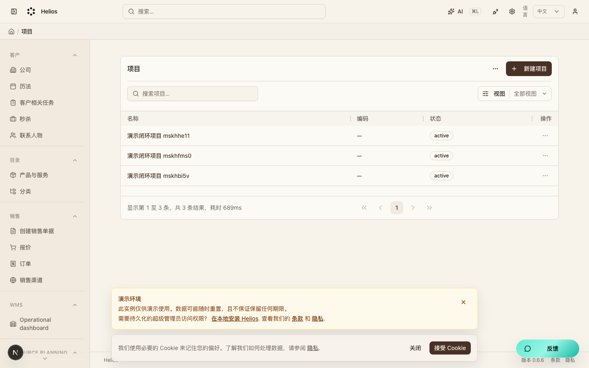
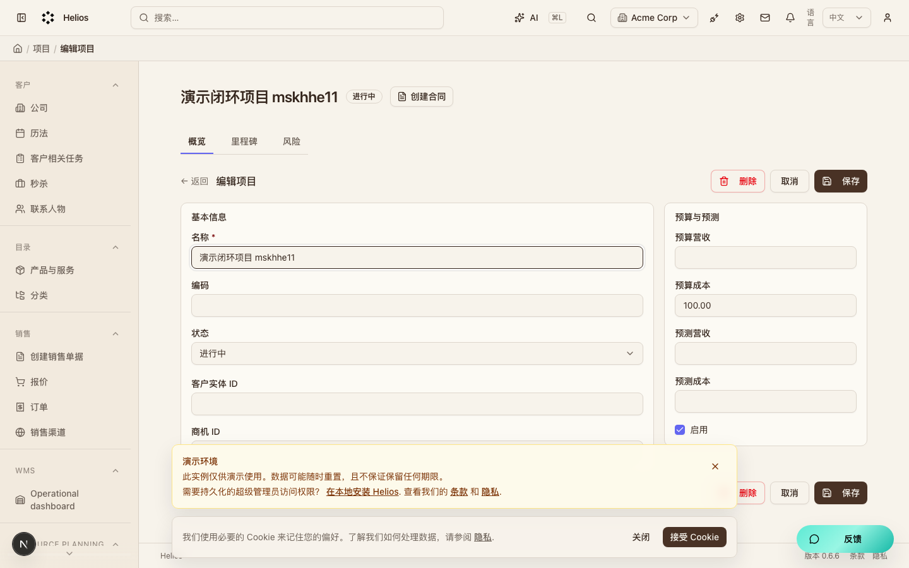
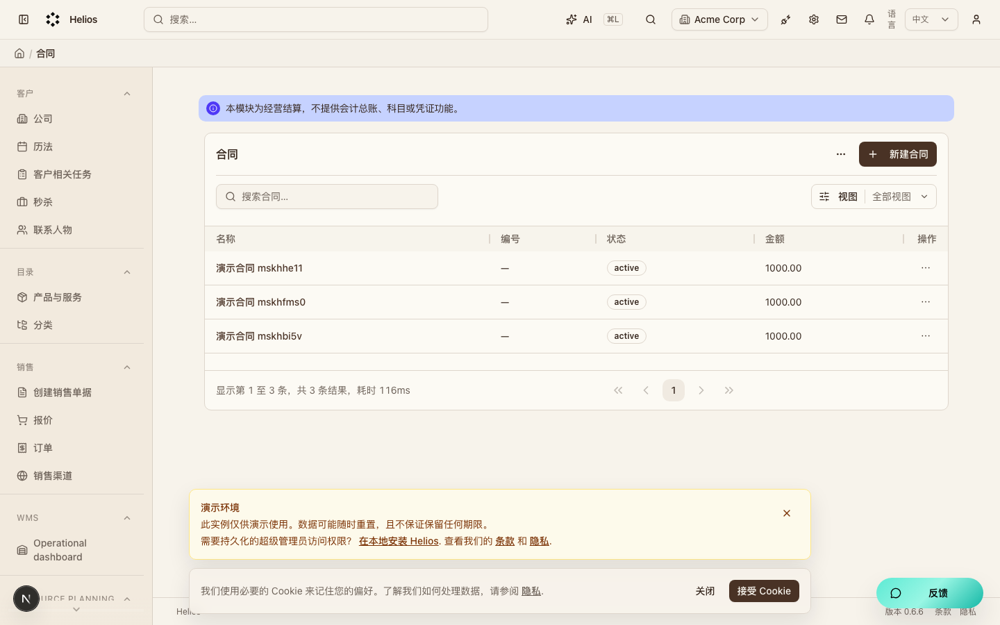
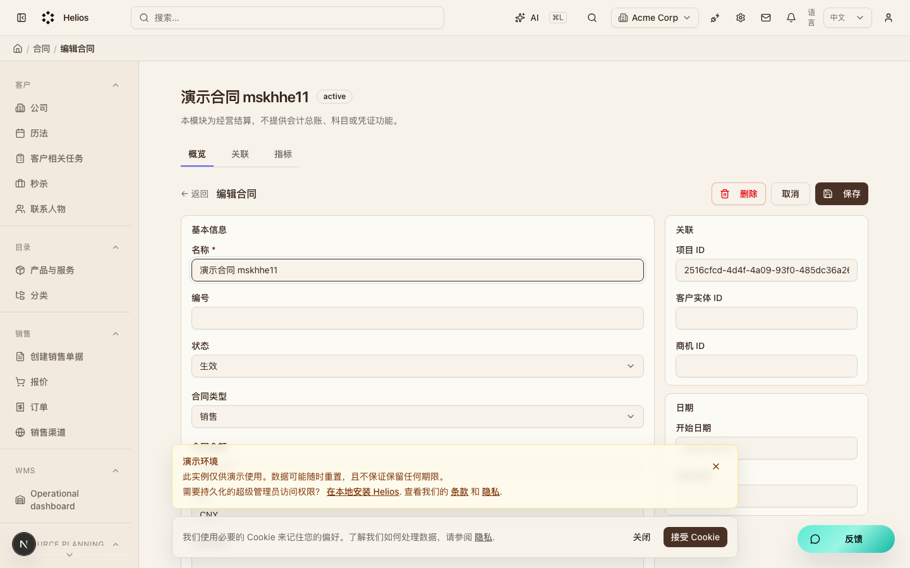
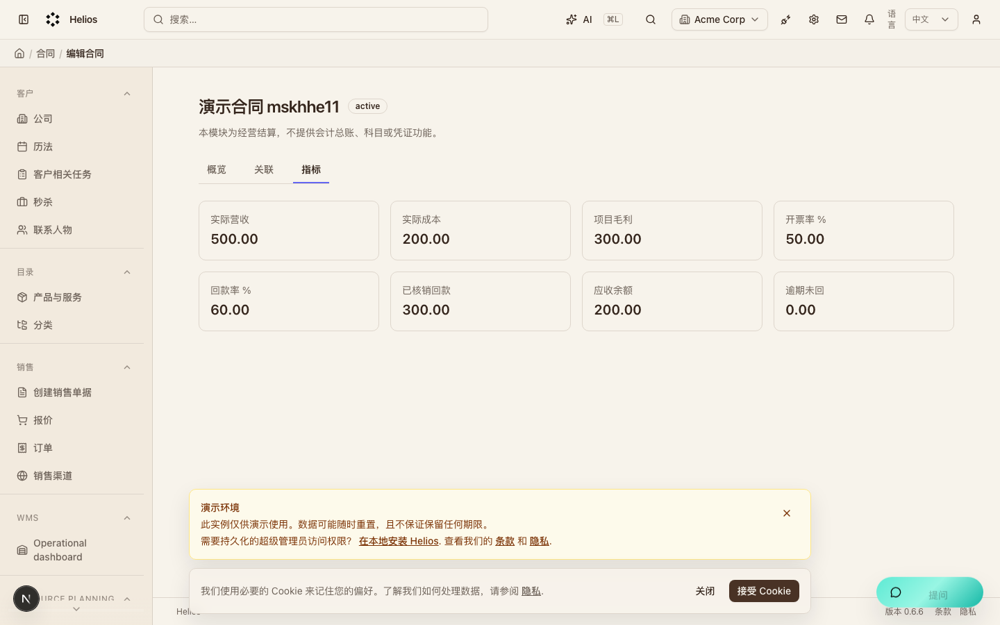
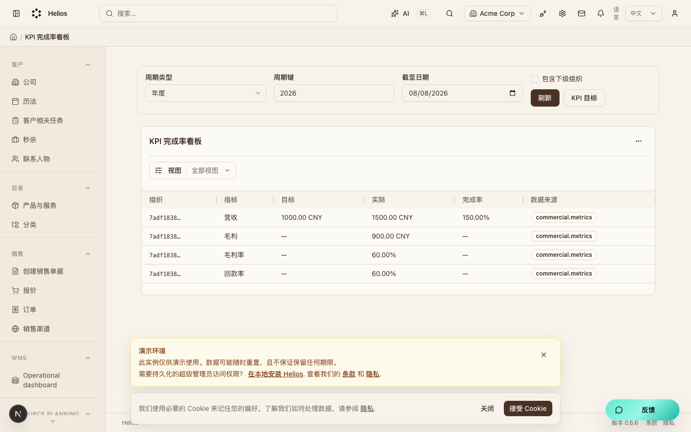
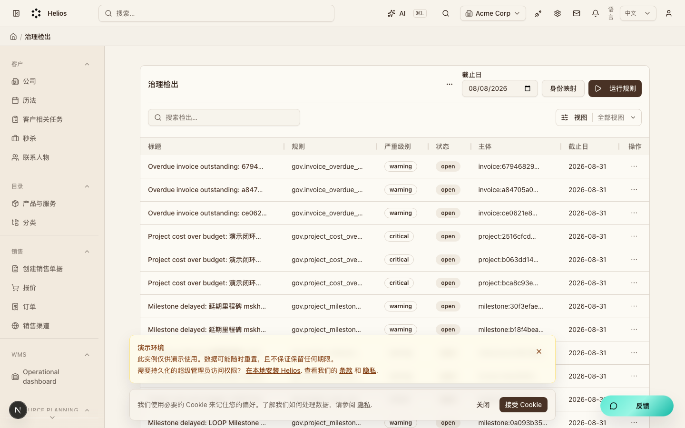

# Helios Flow 经营闭环走查说明

本文用本地真实数据截图说明 M5→M6→M7 经营闭环已经接通。截图来自 2026-08-08 在 `http://localhost:3000` 上的演示环境，登录账号为 `admin@acme.com`。

**看图请用下面任一方式（Cursor 默认 Markdown 预览经常不显示本地图片）：**

1. 用浏览器打开同目录的 [operating-loop-walkthrough.html](./operating-loop-walkthrough.html)（推荐）
2. 在 Cursor 里对本文按 `Cmd+Shift+V` 打开「侧边预览」（Open Preview to the Side），不要用标签栏上的 Preview 开关
3. 直接打开图片目录 [`docs/assets/operating-loop/`](./assets/operating-loop/)

分模块走查（customers / sales / catalog / workflows / projects / commercial / insights / governance）见 [module-walkthroughs/index.html](./module-walkthroughs/index.html)。

相关产品说明见 [PRD.md](./PRD.md) 第 7.7 节与第 11.4 节。实现规格见：

- `.ai/specs/2026-08-07-projects-delivery-module.md`
- `.ai/specs/2026-08-08-commercial-settlement-module.md`
- `.ai/specs/2026-08-08-insights-kpi-and-governance.md`

## 闭环怎么走

```text
客户 / 商机 (customers)
  → 项目 / 里程碑 / 风险 (projects)           [M5]
  → 合同 → 营收 / 成本 → 开票 → 回款核销 (commercial) [M6]
  → KPI 目标与完成率 (insights)              [M7]
  → 治理映射与规则检出 (governance)          [M7]
  → AI 查询、口径解释、确认后处置
```

| 阶段 | 模块 | 后台入口 |
|------|------|----------|
| M5 | `projects` | `/backend/projects` |
| M6 | `commercial` | `/backend/commercial/contracts` |
| M7 KPI | `insights` | `/backend/insights/kpi` |
| M7 治理 | `governance` | `/backend/governance/findings` |

## 1. 项目列表（M5）

入口：`/backend/projects`

项目是交付主档。列表可新建、搜索、编辑与删除项目。演示里创建了多条「演示闭环项目」，状态为进行中（`active`）。



说明：

- 侧栏在「客户 / 目录 / 销售」等业务模块之外，项目与经营模块已注册可用。
- 列表数据来自 `/api/projects/projects`，不是静态假页面。

## 2. 项目详情：里程碑、风险与创建合同

入口示例：`/backend/projects/<projectId>`

详情页有三个页签：概览、里程碑、风险。概览可维护预算与客户 / 商机关联。标题旁有「创建合同」按钮，会带着项目 ID（以及客户、商机 ID，若有）跳到合同新建页。



说明：

- 「创建合同」来自 `commercial` 模块注入到 `detail:projects.project:header`。
- 公司详情页同样可注入「创建合同」（`detail:customers.company:header`）。
- 本演示项目预算成本为 `100.00`，后面治理规则会用到（实际成本高于预算时检出超预算）。

## 3. 合同列表（M6）

入口：`/backend/commercial/contracts`

经营结算登记合同。页面顶部写明：本模块是经营结算，不是总账，不提供科目或凭证。



说明：

- 演示合同金额为 `1000.00`，状态为 `active`。
- 草稿与已取消合同不计入开票率分母；只有 `active` / `completed` 合同参与经营指标。

## 4. 合同详情与关联资源

入口示例：`/backend/commercial/contracts/<contractId>`

合同详情有三个页签：概览、关联、指标。关联页可跳到该合同的营收、成本、开票、核销，以及链接的项目。



本演示写入的结算链（真实 API）：

| 步骤 | 数据 |
|------|------|
| 实际营收 | `500.00` |
| 实际成本 | `200.00` |
| 已开票 | `500.00`（`issued`） |
| 已回款并核销 | `300.00` |
| 应收余额 | `200.00` |

## 5. 合同经营指标

同一合同详情切到「指标」页签。数字来自 `/api/commercial/metrics?contractId=...`，公式与 PRD §7.9 一致。



本演示读数：

| 指标 | 值 | 怎么算 |
|------|----|--------|
| 实际营收 | 500.00 | 实际版营收合计 |
| 实际成本 | 200.00 | 实际版成本合计 |
| 项目毛利 | 300.00 | 营收 − 成本 |
| 开票率 | 50.00% | 已开票 500 ÷ 合同额 1000 |
| 回款率 | 60.00% | 已核销 300 ÷ 已开票 500 |
| 已核销回款 | 300.00 | 核销金额合计 |
| 应收余额 | 200.00 | 开票 − 核销 |
| 逾期未回 | 0.00 或按 asOf 日计算 | 到期且仍有余额的开票 |

口径要点：

- 只有状态为 `issued` 的开票计入开票率、回款率与应收。
- `draft` / `void` 开票不计入经营应收。
- 草稿回款与草稿开票不允许核销。

## 6. KPI 完成率（M7 insights）

入口：`/backend/insights/kpi`

先维护 KPI 目标（如年度营收目标 `1000.00`），看板按组织与期间拉商业指标算完成率。数据来源标记为 `commercial.metrics`。



本演示（年度 2026）：

| 指标 | 目标 | 实际 | 完成率 |
|------|------|------|--------|
| 营收 | 1000.00 | 约 1500.00（多条演示累加） | 150.00% |
| 毛利 / 毛利率 / 回款率 | 未单独设目标时显示为 — | 有实际值 | — |

说明：毛利、毛利率、回款率会显示实际值；只有配置了目标的指标才显示完成率。

## 7. 治理检出（M7 governance）

入口：`/backend/governance/findings`

点击「运行规则」后，系统按规则包扫描并写入检出。每条检出带规则 ID、严重级别、主体与证据链接。



本演示常见检出：

| 规则 ID | 含义 |
|---------|------|
| `gov.project_milestone_delayed` | 计划日已过且无实际完成日的里程碑 |
| `gov.project_cost_over_budget` | 实际成本高于项目预算成本 |
| `gov.invoice_overdue_outstanding` | 已开票到期且仍有应收余额 |
| `gov.customer_duplicate_candidates` | 公司名或域名疑似重复（启发式） |
| `gov.deal_stage_probability_conflict` | 商机阶段与赢率区间不一致 |
| `gov.project_status_conflict` | 项目已完成但仍有未关闭里程碑 |

证据链接可点到项目、里程碑、合同、开票、客户等真实后台页，不是只显示 ID 文本。

## 8. AI 助手（只读查询 + 确认后处置）

四个助手已注册，工具打真实 API：

| Agent ID | 作用 |
|----------|------|
| `projects.delivery_assistant` | 项目 / 里程碑 / 风险查询 |
| `commercial.settlement_assistant` | 合同、开票、回款、经营指标 |
| `insights.kpi_assistant` | KPI 目标与完成率 |
| `governance.assistant` | 身份映射与检出；`acknowledge_finding` 需操作者确认后写入 |

可在全局 AI 助手或 `/backend/config/ai-assistant/playground` 中选择上述 agent。

## 9. 本地如何复现

1. 启动依赖与应用：`yarn dev`（浏览器请打开 `http://localhost:3000`，不要用 `127.0.0.1`，否则开发态前端脚本可能被拦）。
2. 使用演示账号登录：`admin@acme.com` / `secret`。
3. 按上表入口走查；或跑集成测试：

```bash
npx playwright test --config .ai/qa/tests/playwright.config.ts \
  TC-PRJ-001 TC-COM-001 TC-INS-001 TC-GOV-001 TC-LOOP-001 TC-AI-001
```

`TC-LOOP-001` 覆盖：项目 → 合同 → 营收成本 → 开票回款核销 → KPI → 治理规则。

## 10. 截图文件

| 文件 | 内容 |
|------|------|
| `docs/assets/operating-loop/01-projects.png` | 项目列表 |
| `docs/assets/operating-loop/05-project-detail.png` | 项目详情与创建合同 |
| `docs/assets/operating-loop/02-contracts.png` | 合同列表 |
| `docs/assets/operating-loop/06-contract-detail.png` | 合同详情 |
| `docs/assets/operating-loop/07-contract-metrics.png` | 合同指标 |
| `docs/assets/operating-loop/03-insights-kpi.png` | KPI 看板 |
| `docs/assets/operating-loop/04-governance-findings.png` | 治理检出 |

---

文档日期：2026-08-08  
分支参考：`feat/governance-m7`
